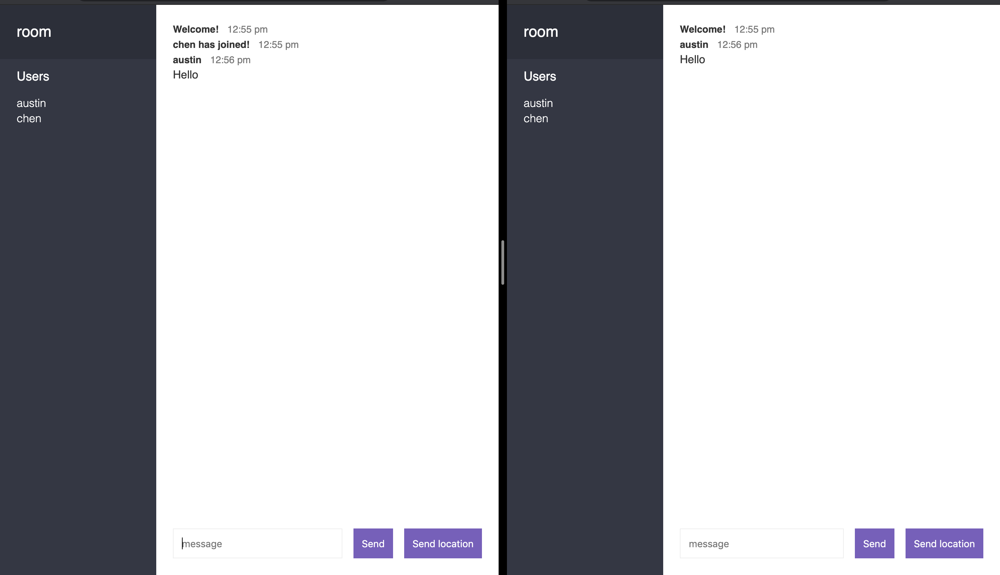

# 使用socket.io建立web聊天室

## -網站連結: <https://austin-chat-app.herokuapp.com/>

* 首頁畫面-輸入username和room name(皆無大小寫之分)
   

* 進入聊天室-(以兩個user為例)

   * 左邊的sidebar-列出room name和所有在此room的users

   * 傳送文字訊息
      

   * 傳送位置資訊-傳送目前所在位置的 google map url
      
